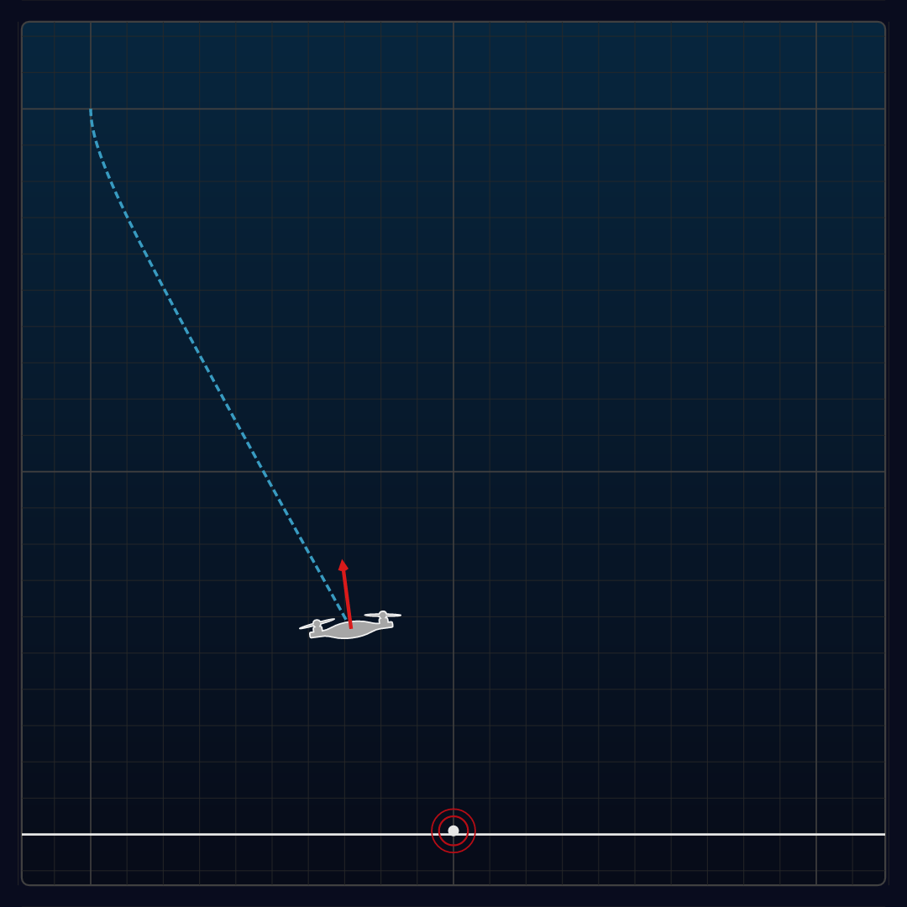

# Quadcopter Optimal Landing: Neural Network Controller

WARNING: This is an initial proof-of-concept, not a carefully polished 
project!



## Quick Instructions

```bash
# Generate Data
pushd generate_data
uv run quadcopter.py  # Wait 50 minutes
popd

# Train
pushd nn
cargo run --release --bin train  # Wait 40 minutes
popd

# Inference
pushd nn
cargo run --release --bin vis_results  # Pretty quick
# Creates PNG frames from animated trajectory in nn/animation
popd
```

See [here](walkthrough.md) for a detailed walkthrough.
